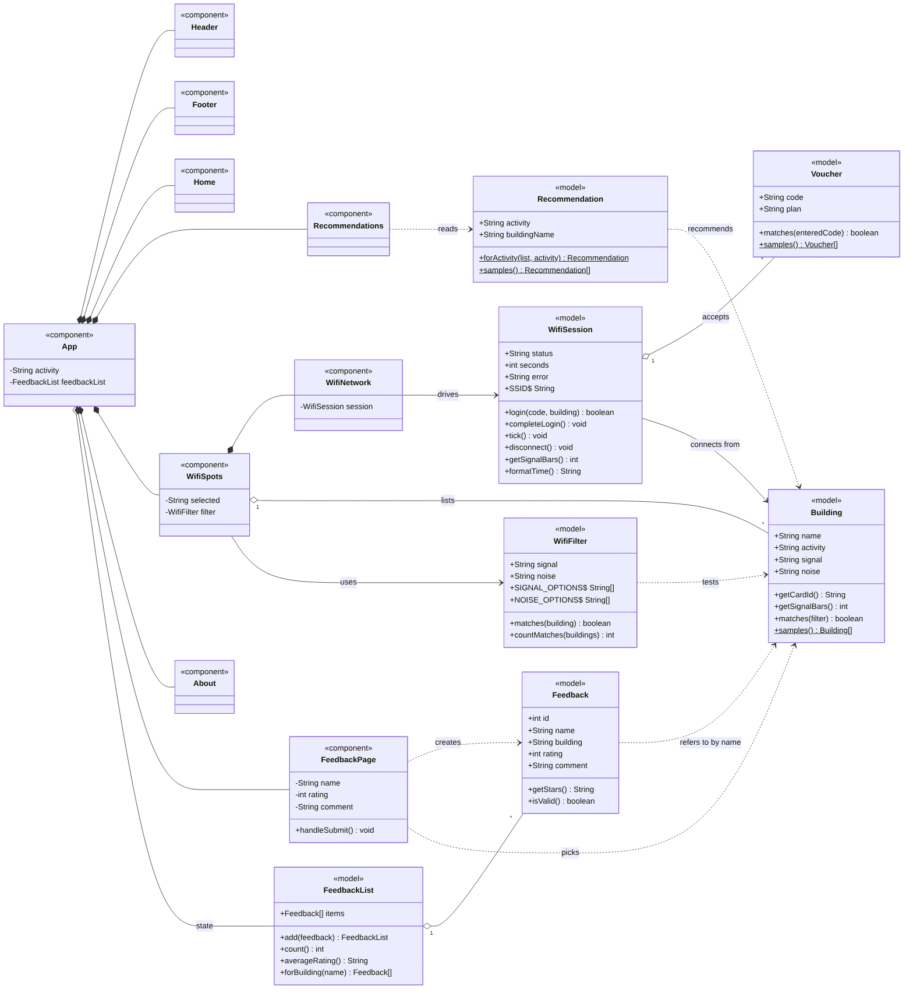

# CIT-U WiFi Spot Guide: Documentation

All WiFi data is **sample data** for a school activity. Nothing connects to or measures a real network.

## 1. Overview

A React (Vite + Tailwind CSS) site with two pages:

| Route | Page | Purpose |
|---|---|---|
| `/` | Home | Hero, activity buttons, WiFi spot cards, simulated WiFi card, About |
| `/feedback` | Feedback | Form to rate a building and a list of submitted reviews |

## 2. Class diagram



Editable source: `docs/class-diagram.mmd` (Mermaid).

### Model classes (`src/models/`)

| Class | Responsibility | Key members |
|---|---|---|
| `Building` | A WiFi spot | `name`, `activity`, `signal`, `noise`, `getCardId()`, `getSignalBars()`, `Building.samples()` |
| `Voucher` | A demo login code | `code`, `plan`, `matches(code)`, `Voucher.samples()` |
| `Recommendation` | Activity to building mapping | `activity`, `buildingName`, `Recommendation.forActivity()` |
| `WifiFilter` | Signal and Noise filters | `signal`, `noise`, `matches(building)`, `countMatches()` |
| `WifiSession` | Login state machine of the WiFi card | `status`, `seconds`, `login()`, `completeLogin()`, `tick()`, `disconnect()`, `formatTime()` |
| `Feedback` | One review | `name`, `building`, `rating`, `comment`, `getStars()`, `isValid()` |
| `FeedbackList` | All reviews | `add()`, `count()`, `averageRating()`, `forBuilding()` |

Relationships:
- `WifiSession` accepts many `Voucher`s and connects from one `Building`.
- `WifiFilter` tests `Building`s; `WifiSpots` lists many `Building`s.
- `FeedbackList` holds many `Feedback`s, and each `Feedback` refers to a building by name.
- `Recommendation` points to a `Building` by name.

### Components

| Component | File | Role |
|---|---|---|
| `App` | `src/App.jsx` | Routes; holds `activity` and `feedbackList` state |
| `Header`, `Footer`, `Home`, `About` | `src/App.jsx` | Static page parts |
| `Recommendation` (drawn as `Recommendations` in the diagram) | `src/App.jsx` | Activity buttons, shows the recommended building |
| `WifiSpots` | `src/App.jsx` | Filters, building cards, Choose Spot |
| `WifiNetwork` | `src/App.jsx` | Voucher login card: Not connected, Logging in, Connected |
| `FeedbackPage` | `src/pages/FeedbackPage.jsx` | Feedback form and list |

## 3. How it works

1. **Pick an activity.** `Recommendation` stores it in `App` state. `App` turns it into `recommendedBuilding`, which `WifiSpots` highlights, and the page scrolls to that card.
2. **Filter spots.** `WifiSpots` keeps the Signal and Noise choices. Cards that don't match fade out.
3. **Choose a spot.** `WifiSpots` stores the selected building and scrolls to the WiFi card.
4. **Log in.** `WifiNetwork` checks the voucher code (demo codes: `CITU-2026`, `STUDY-2HRS`, `GUEST-1DAY`), waits 2 seconds, then counts connected time every second. Signal bars come from the building's signal (Strong = 4, otherwise 3).
5. **Leave feedback.** `FeedbackPage` validates the comment, adds the review to the list kept in `App` (newest first) and shows the average rating. Feedback is kept only while the page is open.

## 4. Current state of the models

The model classes in `src/models/` are initial models and are **not wired into the UI yet**. `App.jsx` still uses plain objects and `useState`. To adopt them:

- Replace the `buildings`, `vouchers` and `recommendations` constants with `Building.samples()`, `Voucher.samples()` and `Recommendation.samples()`.
- Move the login and timer logic of `WifiNetwork` into `WifiSession`.
- Use `Feedback` and `FeedbackList` in `FeedbackPage` and `App`.

## 5. Running and building

```bash
npm install
npm run dev      # development server (http://localhost:5173)
npm run build    # production build in dist/
npm run preview  # preview the production build
```

## 6. Tech stack

React 19, React Router 7, Vite 7, Tailwind CSS 4.
